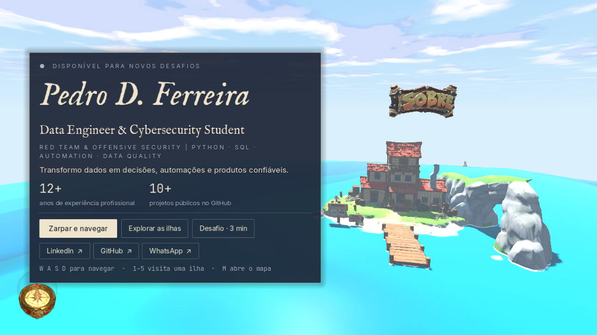
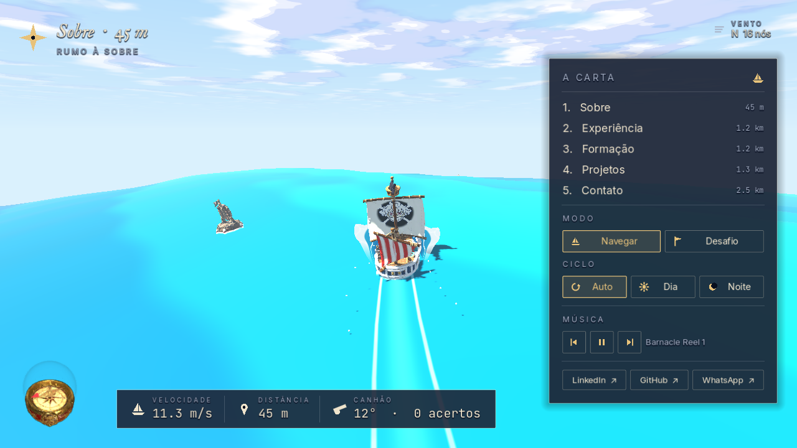
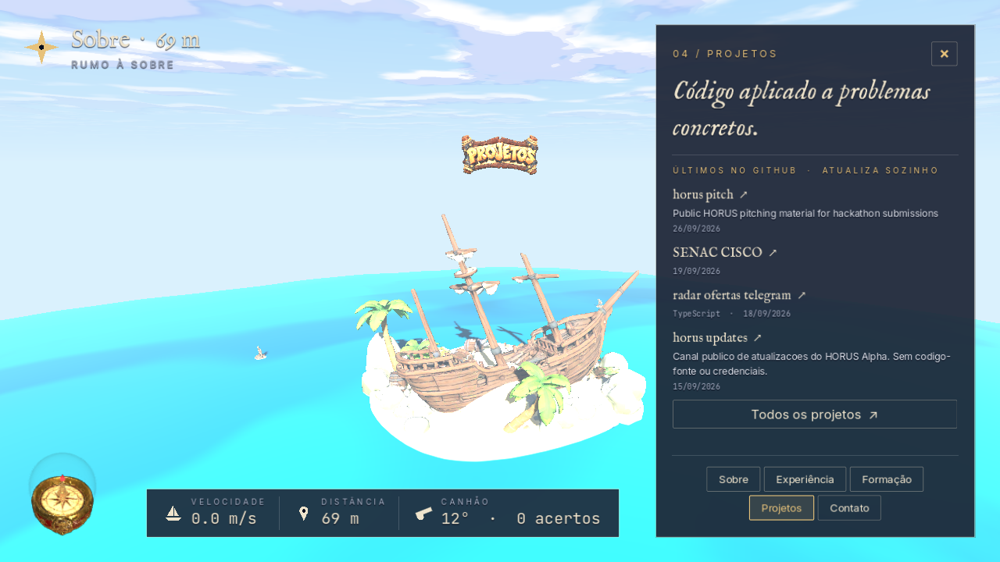
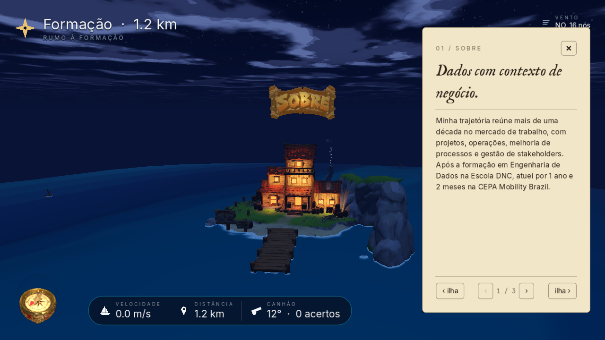
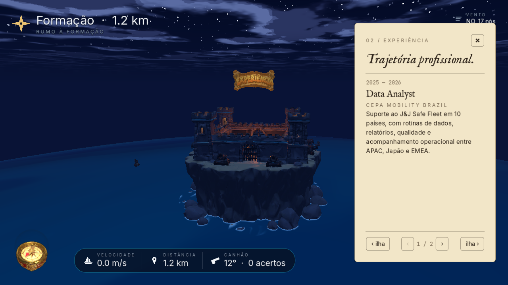
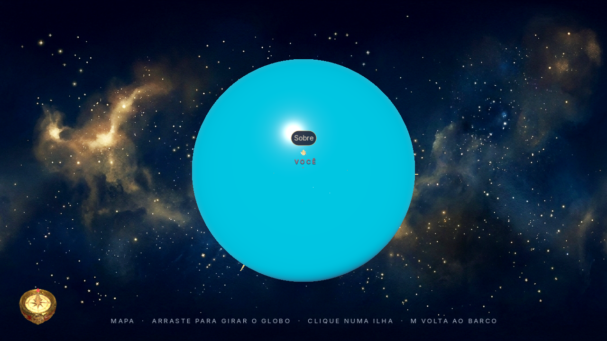
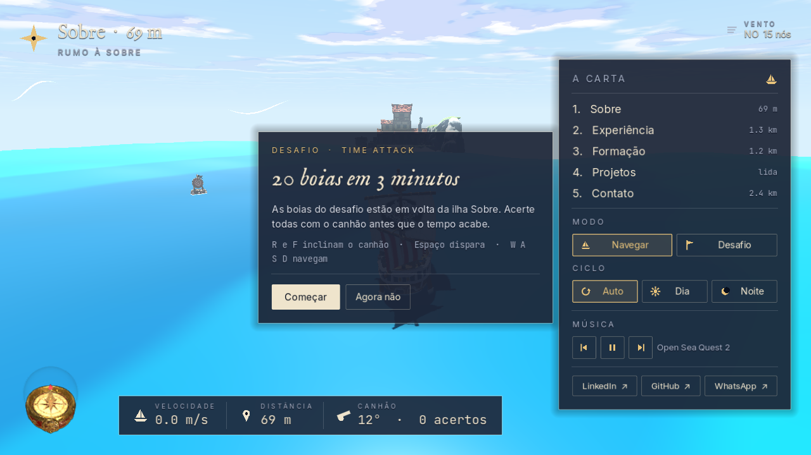
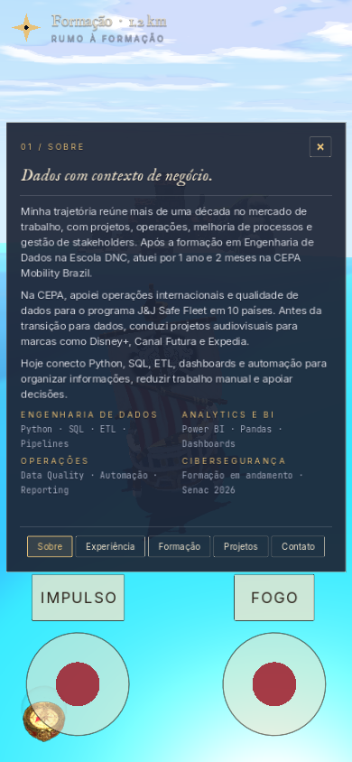

<p align="center">
  
</p>

---

<h1 align="center">GRAND LINE · 3D NAUTICAL PORTFOLIO</h1>

###

<h3 align="left">ABOUT:</h3>

###

<p align="left">
  Interactive portfolio built as a 3D sailing world in Godot 4 and published on the web (WebGL 2) and mobile.<br><br>
  The visitor commands a pirate sloop across a spherical ocean and finds five themed islands, each one a section of my résumé: About, Experience, Education, Projects and Contact. Getting close to an island opens its chart with the content. A guided tour, a world map and a three-minute cannon challenge are available for anyone who prefers not to explore.<br><br>
  The site opens straight into the world. While the 3D scene loads, a business card shows my name, role, summary and contact links, so a recruiter never waits on an empty screen. A text-only reading mode is available for slow connections.<br><br>
  The goal was a portfolio that is fast to read and fun to stay in: Seagazer-style sailing on large, readable waves, a Wind Waker sense of wind and open sea, and a clean nautical interface.
</p>

###

<h3 align="left">CURRENT PROFILE:</h3>

###

- Data Engineer & Cybersecurity Student
- Red Team & Offensive Security | Python · SQL · Automation · Data Quality
- 12+ years of professional experience
- 1 year and 2 months at CEPA Mobility Brazil after the transition to data
- Data Engineering training at Escola DNC and current Cybersecurity studies at Senac

###

<h3 align="left">LANGUAGES AND TOOLS:</h3>

###

<div align="left">
  
  
  
  
  
  
  
  
  
  
  
  
  
  
  
</div>

###

- **Godot 4.7** with GDScript and GLSL-style shaders (Compatibility renderer, WebGL 2)
- **Meshy.ai** for every 3D model: islands, sloop, cannon, buoys, Log Pose compass and title plates
- **Claude and Codex via MCP** as coding agents working directly inside the Godot project
- **Cloudflare Workers** for hosting, chunked asset delivery and the live GitHub projects API
- **glTF-Transform** for mesh simplification and texture resizing
- Fonts: IM Fell English, Inter and JetBrains Mono (SIL Open Font License)

###

<h3 align="left">FEATURES:</h3>

- Opens directly in the 3D world, with an instant business card while it loads
- Five islands anchored on a 800 m planet by latitude and longitude, each with its own animated details
- Island charts that open automatically near the coast, one page per section, with tabs for all five islands
- Projects island shows my latest public GitHub repositories, updated automatically
- Seagazer-style trochoidal (Gerstner) waves with wave groups, calm belts and boat buoyancy matched to the rendered surface
- Global wind system driving the sails, boat speed, wind ribbons and ocean swell direction
- Bow spray sheets, droplets and a foam wake attached to the stern
- Click to ripple the water, hold and drag to carve a continuous trail through it
- Day and night cycle with lit windows, a courtyard bonfire, glowing treasure and a working lighthouse
- Stylized procedural clouds with shadows on the sea
- World map with a 3D rotating globe, island markers and a "you are here" pin
- Cannon challenge: 20 buoys in 3 minutes
- Music player with track names and previous, pause and next controls
- Responsive desktop and mobile layouts with touch joysticks
- Text-only reading mode and graceful fallback when WebGL is unavailable

###

<h3 align="left">SCREENSHOTS:</h3>

<p align="center">
  
  
  
  
  
  
</p>

<p align="center">
  
</p>

###

<h3 align="left">END-TO-END PROCESS:</h3>

###

**1. Concept and references.** The idea started from turning my existing static portfolio into a world worth exploring. The layout direction came from [José Nazaré's portfolio](https://nazarejose.vercel.app), where the site opens straight into a sailing scene, and the interface polish came from the [Melon Jelly Knife](https://claude.ai/artifact/RiTbBMEqgfNwgMHMTAhf5P) artifact: clean hierarchy, readable controls and instant feedback. The art direction mixes One Piece (the Grand Line, the Log Pose, the Den Den Mushi and Poneglyphs), The Legend of Zelda: The Wind Waker (wind as a real system, toon sea), Sea of Thieves (boat feel and cannon), Monkey Island and Pirates of the Caribbean (pirate atmosphere).

**2. 3D assets with Meshy.ai.** Every model was generated and approved in Meshy.ai: five independent islands, the sloop with a clean sail ready for the Jolly Roger, a cannon split into barrel and carriage so only the barrel pitches, the cannonball, floating target buoys, a modular Log Pose and five sculpted title plates. Nothing was regenerated during development; problems were solved in the engine.

**3. First prototype with Codex.** Codex, connected to the project via MCP, built the first Godot scene: a spherical ocean, the islands, a playable sloop, the camera modes, the cannon and the first time-attack logic. That phase produced a long list of shader failures (grid patterns, banding, "boiling" water, a jelly-looking planet) that became the rules for everything after it.

**4. Project brief and planning with Claude.** I wrote a full brief with the product goal, the asset list, every past failure and a mandatory process: understand, plan and ask, then execute. Claude, also connected via MCP, read the whole project, measured all ten island and plate bounding boxes inside Godot, listed what the brief got wrong compared with the real files and proposed a plan before touching anything.

**5. World scale and island anchoring.** The planet grew from 200 m to an 800 m radius, kept as a free parameter in a single `WorldLayout` resource. Islands are placed by latitude and longitude instead of hand-placed transforms, with an orthonormal basis that keeps each island upright even at the poles, and a submersion value measured from each model's base profile so every island meets the waterline at its rocks.

**6. Ocean and boat.** The water is a trochoidal (Gerstner) field computed in world space along wind-aligned directions. The distant planet stays a perfect sphere with waves only in the fragment shader; a high-resolution patch follows the boat (or the island being visited) and displaces real vertices. The same wave math runs on the CPU, so the hull, buoys and cannonballs float on exactly the surface you see. The waterline was calibrated by measuring the keel against the water over time.

**7. Wind, effects and islands.** A global `WindManager` drives the sails, boat speed, wind ribbons and swell direction. The sails fill with speed, the flag flutters like cloth, bow sheets curl at the prow and a wake trails from the stern. Island lights were positioned by ray-casting onto the actual meshes: lit window panes and chimney smoke on the About harbor, a bonfire and tower lights in the fort, a floating Poneglyph, glowing treasure chests and a lighthouse whose lantern glass shines from inside.

**8. Interface.** After several iterations the HUD settled on a navy chart style shared with the loading card: destination and wind at the top, compact telemetry at the bottom, a collapsible chart with islands, mode, day cycle, music and contact links, and island charts that always fit on one page. All icons are drawn in code, so nothing breaks into missing glyphs on the web.

**9. Web and mobile.** The project runs on the Compatibility renderer (WebGL 2), the only web target in Godot 4.7, which also covers phones. Runtime models were optimized with glTF-Transform (islands from up to 107 MB down to about 3 to 4 MB each), textures use Basis Universal, and music streams from the browser instead of the game package. Touch joysticks, a portrait layout and a mobile island drawer were added.

**10. Hosting and deploy.** Cloudflare Workers serves the site on the same domain as my previous portfolio. Because static assets are limited to 25 MiB per file, the build script splits the game package into parts that the Worker stitches together on request, and serves the WebAssembly binary pre-compressed with Brotli. The Worker also exposes `/api/projetos`, which reads my latest public repositories from the GitHub API and caches them at the edge.

**11. Testing loop.** Every change was checked with headless Godot runs and scripted screenshots in the same renderer used on the web, then tested by me in the browser and on a phone through a local Worker before publishing.

###

<h3 align="left">PROJECT STRUCTURE:</h3>

```text
portfolio-grand-line-3d/
├── Assets/
│   ├── Fonts/                 # IM Fell English, Inter, JetBrains Mono (OFL)
│   ├── Optimized/             # web-ready GLBs (original Meshy exports stay local)
│   └── Sound/SFX/             # sound effects (music streams from the web build)
├── Config/
│   ├── world_layout.tres      # planet radius, wind, waves, island lat/lon
│   ├── portfolio_content.json # résumé content shown in the world and loading card
│   └── music_playlist.json
├── Scenes/                    # cannon, Log Pose HUD, title signs, wind ribbons
├── Scripts/
│   ├── UI/                    # nautical HUD, theme and vector icons
│   ├── World/                 # WorldLayout and IslandAnchor resources
│   ├── main_world.gd          # world assembly, lighting, music, input
│   ├── sloop.gd               # sailing and buoyancy
│   ├── SphericalOceanSimulation.gd
│   ├── IslandEffects.gd       # per-island lights and animations
│   └── NavalGame.gd           # cannon, buoys and challenge
├── Shaders/                   # ocean, patch, sky, sails, bow spray, droplets
├── Tests/                     # headless checks, measurements and screenshots
├── Export/                    # web shell (loading card) and world config
├── Web/
│   ├── build.ps1              # export + chunking + Brotli + music
│   ├── worker.js              # Cloudflare Worker
│   └── wrangler.toml
├── docs/images/
├── MainWorld.tscn
└── project.godot
```

###

<h3 align="left">RUN LOCALLY:</h3>

Open `project.godot` in **Godot 4.7** and press F5. The original Meshy exports are not tracked in Git because of their size; the optimized models in `Assets/Optimized` are enough to run the world.

To build and serve the web version:

```powershell
pwsh Web/build.ps1
npx wrangler dev --config Web/wrangler.toml --port 8787
```

Open `http://localhost:8787`.

###

<h3 align="left">DEPLOY:</h3>

```powershell
npx wrangler login
npx wrangler deploy --config Web/wrangler.toml
```

###

<h3 align="left">LIVE SITE:</h3>

<p align="left">
  <a href="https://portfolio-data-cybersecurity.data-pedutraferreira.workers.dev/">Open the live portfolio on Cloudflare</a>
</p>

###

<h3 align="left">REFERENCES AND CREDITS:</h3>

- Portfolio references: [José Nazaré](https://www.linkedin.com/in/josenazare/) ([site](https://nazarejose.vercel.app)) and [Pievetti](https://www.linkedin.com/in/pievetti/)
- Interface reference: [Melon Jelly Knife](https://claude.ai/artifact/RiTbBMEqgfNwgMHMTAhf5P)
- Art references: One Piece, The Legend of Zelda: The Wind Waker, Sea of Thieves, Monkey Island and Pirates of the Caribbean
- Technical references: Seagazer's bow spray article on Jettelly, the trochoidal wave model and the open-source `godot-4-stylized-sky` and `water-wakes` studies
- Music: AI-generated tracks and a fan remake of "The Great Sea" (not the official soundtrack)
- All referenced franchises belong to their respective owners; this is a non-commercial personal portfolio

###

<h3 align="left">SECURITY AND PRIVACY:</h3>

- No API keys, access tokens or passwords are required
- The GitHub projects endpoint uses only the public GitHub API and edge caching
- Local builds, backups and original large assets are ignored by Git
- The public WhatsApp link is intentional and used as the contact channel

###

<h3 align="left">CONTACT:</h3>

<p align="left">
  <a href="https://www.linkedin.com/in/data-pdf/">LinkedIn</a> ·
  <a href="https://github.com/DATAdotPDF">GitHub</a> ·
  <a href="https://api.whatsapp.com/send/?phone=5521964094297&text&type=phone_number&app_absent=0">WhatsApp</a>
</p>
